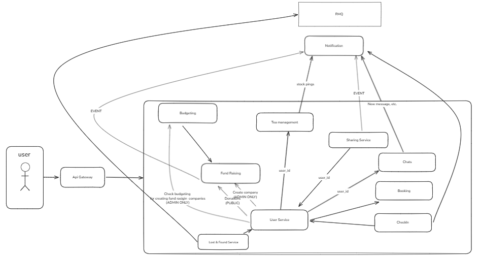

# FAFCab Microservices Architecture

Description of the architecture of a microservices-based system for the FAFCab, designed to support internal operations through modular, scalable services. The system uses an event-driven model with RabbitMQ as the message broker and an API Gateway for external access.

---

## Services Overview

| ID | Service Name            | Primary Function |
|----|-------------------------|------------------|
| 1  | User Management         | Manage user profiles, roles, and identity synchronization with Discord |
| 2  | Notification  | Centralized delivery of real-time alerts and notifications |
| 3  | Communication            | Enable public/private chats with moderation and censorship |
| 4  | Tea Management          | Monitor tea, sugar, cups, paper, and markers consumption |
| 5  | Cab Booking             | Schedule room bookings; integrate with Google Calendar |
| 6  | Check-in                | Monitor entry/exit via facial recognition; detect unknown visitors |
| 7  | Lost & Found            | Post and track lost/found items with comments and resolution status |
| 8  | Budgeting               | Track income, expenses, donations, debts, and generate reports |
| 9  | Fund Raising            | Launch campaigns, collect donations, manage goals |
| 10 | Sharing                 | Manage shared equipment and rental tracking |
---
## Architecture Scheme


## Core Architecture Components

- **API Gateway**: Entry point for all client requests.
- **RabbitMQ (RMQ)**: Message broker enabling asynchronous communication between services.
- **Notification Service**: Central hub for sending alerts via email, push, or Discord.
- **User Service**: Identity provider used across all services.

All services communicate either directly via REST APIs or asynchronously using events over RMQ.

---

## Service Boundaries and Interactions

### 1. User Management Service
- **Responsibility**: Store and manage user data including roles (`admin`, `student`, `teacher`, `executor`).
- **Integrations**:
  - Syncs user data from Discord.
  - Provides `user_id` and role information to all other services.
- **Events Received**:
  - New user detection from Check-in.
  - Ban actions from Communication Service.

### 2. Tea Management Service
- **Responsibility**: Track inventory & consumption for consumables (tea, sugar, cups, paper, markers) and evaluate low-stock thresholds.
- **Dependencies**:
  - User Service: For identifying users who consume resources.
  - Notification Service: To send low-stock alerts.
- **Event Emitted**:
  - `low_stock`: Triggered when stock levels fall below threshold → sent to Notification Service.
  - `restocked`: Triggered when stock is being renewed → sent to Notification Service.

### 3. Cab Booking Service
- **Responsibility**: Handle room and kitchen space reservations.
- **Integrations**:
  - Google Calendar: Synchronize booking schedules.
  - User Service: Validate booker identity.
  - Notification Service: Send reminders about upcoming bookings.
- **Event Emitted**:
  - `booking_confirmed`: Sent to Notification Service upon confirmation.

### 4. Check-in Service
- **Responsibility**: Record entries and exits using facial recognition.
- **Integrations**:
  - User Service: Verify known users.
  - Notification Service: Alert admins if unknown individuals are detected.
- **Events Emitted**:
  - `entry/exit`: Logs user presence.
  - `unknown_user_detected`: Triggers alert to Notification Service.
  - Sends `user_id` to Tea Management, Sharing, and other services on entry.

### 5. Lost & Found Service
- **Responsibility**: Allow posting of lost or found items with comment threads.
- **Dependencies**:
  - User Service: Authenticate posters.
  - Notification Service: Notify users of updates.
- **Events Emitted**:
  - `post_created`, `comment_added`, `resolved`: Sent to Notification Service.

### 6. Budgeting Service
- **Responsibility**: Maintain financial records including income, expenses, donations, and debts.
- **Integrations**:
  - Fund Raising: Receives final purchase records.
  - Sharing: Updates debt log when items are damaged.
  - User Service: Links debts to users.
- **Events Emitted**:
  - `low_balance`: Alerts admins via Notification Service.
- **Events Received**:
  - `donation`, `expense`, `debt_update` from Fund Raising, Sharing, and Tea Management.

### 7. Fund Raising Service
- **Responsibility**: The Fund Raising Service manages fundraising campaigns for purchasing new equipment and supplies for FAF Cab. It handles campaign creation, donation tracking, completion monitoring, and automatic integration with other services upon campaign completion.

- **Service Boundaries**:
  - Fundraising campaign lifecycle management
  - Donation tracking and processing
  - Campaign completion and fund distribution
  - Integration with Budgeting Service for fund transfers
  - Automatic item registration upon campaign completion

- **Business Rules**:
    When a campaign reaches its goal or expires:
  - Campaign status updated to `completed`, the left over is transferred in the Budget Service as donation.
  - If successful and type is `Sharing`: Item automatically registered in Sharing Service
  - If successful and type is `Tea`: Item automatically registered in Tea management Service
  - Notifications sent to all donors about completion/expiration


### 8. Sharing Service
- **Responsibility**: The Sharing Service manages multi-use objects available for rental in FAF Cab, including games, cords, cups, kettles, and other shared equipment. It tracks item availability, rental status, condition, and handles notifications to owners.

- **Service Boundaries**:
  - Item inventory management
  - Rental tracking and status updates
  - Item condition monitoring
  - Owner and user notifications
  - Debt tracking for damaged items
    
-**Business Rules**:
    When takes an item in rent:
  - Created record with user&item data and duration.
  - Before overdue there is notification send
  - If user brakes the item it is leveraged method from Budget Service to create  debt record with the item price.
  - Notifications sent to owners about rental of their items/return status.

### 9. Communication Service
- **Responsibility**: Public/private chats, message storage, search, and moderation (filters, reports, sanctions)
- **Features**:
  - Censorship based on banned words.
  - Role-based access control.
  - Reporting and sanctioning (mute, ban).
- **Integrations**:
  - User Service: For user identification and role checks.
  - Notification Service: Deliver message notifications.
- **Events Emitted**:
  - `new_message`: Triggered when new message received in any of the chat type → sent to Notification Service.
  - `message_flagged`: Triggered when message hit the banword and/or get filtered → sent to Notification Service.
  - `sanction_applied`: Triggered when mute/ban placed on user → sent to Notification Service.
  - `member_joined`: Triggered when user joins the group chat → sent to Notification Service.
  - `member_left`: Triggered when user leaves the group chat → sent to Notification Service.
- **Events Received**:
  - `banned_words_list` from admin configuration.

### 10. Notification Service
- **Responsibility**: Centralized delivery of alerts and messages.
- **Functionality**:
  - Subscribes to events from all services.
  - Routes notifications to appropriate channels (Discord, email, etc.).
  - Uses RabbitMQ queues filtered by audience: ALL, Admins, Students, Teachers.
- **Events Received**:
  - From all services: `low_stock`, `restocked`, `booking_confirmed`, `unknown_user`, `post_updated`, `donation_success`, `item_taken`, `new_message`, `message_flagged`, `sanction_applied`, `member_joined`, `member_left`,`low_funds`.

---

## Communication Contract


## 1. User Management Service

### Technologies used

- FastAPI — HTTP API for commands/queries; dependency injection & OpenAPI docs.
- Pydantic v2 — request/response validation and schema serialization.
- SQLAlchemy 2 + Alembic — ORM and database migrations.
- PostgreSQL — primary relational store for users, roles, groups.
- Redis — caching user profiles and session tokens.
- Kafka or NATS — event bus for user.* domain events.
- Celery or RQ (with Redis) — background jobs (sync Discord data, role updates).
- OpenTelemetry + Prometheus + Grafana — tracing, metrics, dashboards.
- Sentry — error monitoring and alerting.
- pytest + pytest-asyncio — unit/integration tests.
- Docker + Kubernetes — containerization and deployment automation.
- GitHub Actions — CI/CD (lint, tests, build, deploy).

---

### POST /users — Create user

Request JSON:

```json
{
  "name": "Alice Johnson",
  "username": "alice",
  "email": "alice@example.com",
  "role": ["student"],
  "group_ids": ["g_123"]
}
```

Response 201 JSON:

```json
{
  "id": "u_42",
  "name": "Alice Johnson",
  "username": "alice",
  "email": "alice@example.com",
  "roles": ["student"],
  "group_ids": ["g_123"],
  "created_at": "2025-09-11T10:00:00Z",
  "updated_at": "2025-09-11T10:00:00Z"
}
```

Errors:

- 409 CONFLICT (duplicate username/email)
- 422 VALIDATION_ERROR

---

### GET /users — List users

Query: q, role, group_id, limit, cursor

Response 200 JSON:

```json
{
  "users": [
    {
      "id": "u_42",
      "name": "Alice Johnson",
      "username": "alice",
      "email": "alice@example.com",
      "roles": ["student"],
      "group_ids": ["g_123"],
      "created_at": "2025-09-11T10:00:00Z",
      "updated_at": "2025-09-11T10:00:00Z"
    }
  ],
  "next_cursor": null
}
```

---

### GET /users/{user_id} — User details

Path: user_id (string)

Response 200 JSON:

```json
{
  "id": "u_42",
  "name": "Alice Johnson",
  "username": "alice",
  "email": "alice@example.com",
  "roles": ["student"],
  "group_ids": ["g_123"],
  "created_at": "2025-09-11T10:00:00Z",
  "updated_at": "2025-09-11T10:00:00Z"
}
```

Errors:

- 404 NOT_FOUND

---

### PATCH /users/{user_id} — Update user metadata

Request JSON (partial):

```json
{
  "name": "Alice J.",
  "roles": ["student", "executor"],
  "group_ids": ["g_123", "g_456"]
}
```

Response 200 JSON: (same shape as GET /users/{id})

Errors:

- 404 NOT_FOUND
- 422 VALIDATION_ERROR

---

### DELETE /users/{user_id} — Soft delete user

Response 204 No Content

Errors:

- 404 NOT_FOUND

---

### GET /users/{user_id}/groups — List user's groups

Response 200 JSON:

```json
{
  "groups": [
    { "id": "g_123", "name": "Math Class", "type": "class" },
    { "id": "g_456", "name": "Lab Team", "type": "project" }
  ],
  "next_cursor": null
}
```

---

### GET /discord/groups — Fetch Discord group data

Response 200 JSON:

```json
{
  "groups": [
    { "id": "d_g1", "name": "Math Class", "members": ["u_42", "u_43"] },
    { "id": "d_g2", "name": "Lab Team", "members": ["u_42"] }
  ]
}
```

---

### Event Envelopes (emitted via bus)

Generic envelope (CloudEvents-like):

```json
{
  "id": "evt-123",
  "type": "<domain.event>",
  "source": "user-svc",
  "time": "2025-09-11T10:00:01Z",
  "specversion": "1.0",
  "data": { ... }
}
```

Examples:

#### user.created
```json
{
  "id": "evt-001",
  "type": "user.created",
  "source": "user-svc",
  "time": "2025-09-11T10:00:00Z",
  "specversion": "1.0",
  "data": {
    "user_id": "u_42",
    "name": "Alice Johnson",
    "username": "alice",
    "email": "alice@example.com",
    "roles": ["student"],
    "group_ids": ["g_123"]
  }
}
```

#### user.role.updated
```json
{
  "id": "evt-002",
  "type": "user.role.updated",
  "source": "user-svc",
  "time": "2025-09-11T10:05:00Z",
  "specversion": "1.0",
  "data": {
    "user_id": "u_42",
    "old_roles": ["student"],
    "new_roles": ["student", "executor"]
  }
}
```

---


### 2. Tea Management Service
#### Technologies used
- FastAPI — HTTP API for commands/queries; dependency injection & OpenAPI docs.
- Pydantic v2 — request/response validation and schema serialization.
- SQLAlchemy 2 + Alembic — ORM and database migrations.
- PostgreSQL — primary relational store for items, batches, thresholds, consumption.
- Postgres materialized views — fast stock/consumption reports without heavy joins.
- Redis — caching hot reads (current stock) and lightweight distributed locks (e.g., recounts).
- Kafka or NATS — event bus for inventory.* domain events.
- Celery or RQ (with Redis) — background jobs (CSV exports, threshold scans).
- OpenTelemetry + Prometheus + Grafana — tracing, metrics, dashboards.
- Sentry — error monitoring and alerting.
- pytest + pytest-asyncio — unit/integration tests.
- Docker + Kubernetes — containerization and deployment automation.
- GitHub Actions — CI/CD (lint, tests, build, deploy).


#### POST `/items` — Create item 
  Request JSON:
  ```
    {
      "name": "Tea Bags",
      "unit": "bag",
      "category": "beverage",
      "sku": "TEA-001",
      "active": true,
      "track_expiry": false,
      "min_stock_qty": 50,
      "tags": ["kitchen", "green"]
    }
  ```
  Response 201 JSON:
  ```
    {
      "id": "9b2f1b53-3f8a-4e5a-93d7-4a7a5b1f8f0e",
      "name": "Tea Bags",
      "unit": "bag",
      "category": "beverage",
      "sku": "TEA-001",
      "active": true,
      "track_expiry": false,
      "min_stock_qty": 50,
      "tags": ["kitchen","green"],
      "stock_qty": 0,
      "soon_expiring": [],
      "created_at": "2025-09-11T10:00:00Z",
      "updated_at": "2025-09-11T10:00:00Z"
    }
  ```
  Errors:
  - 409 CONFLICT (duplicate name/sku)
  - 422 VALIDATION_ERROR

#### GET `/items` — List items
  Query: q, category, low_stock (bool), active (bool), limit, cursor
  Response 200 JSON:
  ```
    {
      "items": [
        {
          "id": "9b2f1b53-3f8a-4e5a-93d7-4a7a5b1f8f0e",
          "name": "Tea Bags",
          "unit": "bag",
          "category": "beverage",
          "sku": "TEA-001",
          "active": true,
          "track_expiry": false,
          "min_stock_qty": 50,
          "tags": ["kitchen"],
          "stock_qty": 120,
          "soon_expiring": [],
          "created_at": "2025-09-11T10:00:00Z",
          "updated_at": "2025-09-11T10:05:00Z"
        }
      ],
      "next_cursor": null
    }
  ```

#### GET `/items/{item_id}` — Item details + live stock
  Path: item_id (uuid) \
  Response 200 JSON:
  ```
    {
      "id": "9b2f1b53-3f8a-4e5a-93d7-4a7a5b1f8f0e",
      "name": "Tea Bags",
      "unit": "bag",
      "category": "beverage",
      "sku": "TEA-001",
      "active": true,
      "track_expiry": false,
      "min_stock_qty": 50,
      "tags": ["kitchen"],
      "stock_qty": 120,
      "soon_expiring": [
        { "batch_id": "b1", "expiry_date": "2025-10-01", "qty_remaining": 20 }
      ],
      "created_at": "2025-09-11T10:00:00Z",
      "updated_at": "2025-09-11T10:05:00Z"
    }
  ```
  Errors: 
  - 404 NOT_FOUND

#### PATCH `/items/{item_id}` — Update metadata
  Request JSON (partial):
  ```
    { "name": "Tea Bags (Jasmine)", "min_stock_qty": 80, "tags": ["kitchen","jasmine"] }
  ```
  Response 200 JSON: (same shape as GET /items/{id})\
  Errors: 
  - 404 NOT_FOUND
  - 422 VALIDATION_ERROR

#### POST `/items/{item_id}/batches` — Add stock lot
  Request JSON:
  ```
    {
      "batch_code": "PO-9876",
      "supplier_ref": "SUP-1",
      "expiry_date": "2025-12-31",
    }
    ```
  Response 201 JSON:
  ```
    {
      "id": "b1",
      "item_id": "9b2f1b53-3f8a-4e5a-93d7-4a7a5b1f8f0e",
      "batch_code": "PO-9876",
      "supplier_ref": "SUP-1",
      "expiry_date": "2025-12-31",
      "qty_received": 200,
      "qty_remaining": 200,
      "currency": "USD",
      "cost_total": 49.90,
      "received_at": "2025-09-11T11:00:00Z"
    }
    ```
  Side-effect events: `inventory.restocked`\
  Errors: 
  - 404 NOT_FOUND
  - 422 VALIDATION_ERROR

#### GET `/items/{item_id}/batches` — List lots
  Response 200 JSON:
  ```
    {
      "batches": [
        { "id": "b1", "item_id": "…", "batch_code": "PO-9876", "expiry_date": "2025-12-31", "qty_received": 200, "qty_remaining": 200, "currency": "USD", "cost_total": 49.90, "received_at": "2025-09-11T11:00:00Z" }
      ],
      "next_cursor": null
    }
  ```

#### POST `/items/{item_id}/consume` — Record consumption (append-only)
  Request JSON:
  ```
    {
      "qty": 3,
      "batch_id": null,              // optional; FIFO selection if null
      "user_id": "u_42",
      "source": "self_service",      // self_service | event | admin
      "notes": "afternoon tea",
      "consumed_at": "2025-09-11T12:00:00Z"
    }
    ```
  Response 201 JSON:
  ```
    {
      "id": "ce1",
      "item_id": "9b2f1b53-3f8a-4e5a-93d7-4a7a5b1f8f0e",
      "batch_id": "b1",
      "qty": 3,
      "user_id": "u_42",
      "source": "self_service",
      "notes": "afternoon tea",
      "consumed_at": "2025-09-11T12:00:00Z",
      "created_at": "2025-09-11T12:00:01Z"
    }
    ```
  Side-effect events: possibly `inventory.low_stock` if threshold crossed\
  Errors: 
  - 404 NOT_FOUND (item/batch) 
  - 409 CONFLICT (insufficient stock)
  - 422 VALIDATION_ERROR

#### GET `/consumption` — Query usage
  Query: 
  - item_id, 
  - user_id, 
  - from, 
  - to, 
  - aggregate=[day|week|month], 
  - limit, 
  - cursor\
  Response 200 JSON:
  ```
    {
      "events": [
        { "id":"ce1","item_id":"…","qty":2,"user_id":"u_1","source":"self_service","consumed_at":"2025-09-11T12:00:00Z" }
      ],
      "totals": { "qty": 2, "by_item": { "…": 2 }, "by_user": { "u_1": 2 } },
      "next_cursor": null
    }
```

#### POST `/thresholds` — Upsert low-stock rule
  Request JSON:

    {
      "item_id": "9b2f1b53-3f8a-4e5a-93d7-4a7a5b1f8f0e",
      "min_qty": 50,
      "notify_config": { "channels": ["tea-room"], "notify_roles": ["inventory_admin"] }
    }

  Response 201 JSON:
  ```
    {
      "id": "th1",
      "item_id": "9b2f1b53-3f8a-4e5a-93d7-4a7a5b1f8f0e",
      "min_qty": 50,
      "notify_config": { "channels": ["tea-room"], "notify_roles": ["inventory_admin"] },
      "created_at": "2025-09-11T10:10:00Z",
      "updated_at": "2025-09-11T10:10:00Z"
    }
```

#### GET `/thresholds` — List thresholds
  Response 200 JSON:
  ```
    {
      "thresholds": [
        { "id":"th1","item_id":"…","min_qty":50,"notify_config":{"channels":["tea-room"],"notify_roles":["inventory_admin"]},"created_at":"…","updated_at":"…" }
      ],
      "next_cursor": null
    }
  ```

#### POST `/announcements` — Create announcement
  Request JSON:

    {
      "title": "New tea arrived!",
      "body": "Try jasmine.",
      "effective_from": "2025-09-12T09:00:00Z",
      "item_ids": ["9b2f1b53-3f8a-4e5a-93d7-4a7a5b1f8f0e"]
    }

  Response 201 JSON:

    {
      "id":"an1",
      "title":"New tea arrived!",
      "body":"Try jasmine.",
      "published_by":"u_admin",
      "effective_from":"2025-09-12T09:00:00Z",
      "created_at":"2025-09-11T12:15:00Z",
      "item_ids":["9b2f1b53-3f8a-4e5a-93d7-4a7a5b1f8f0e"]
    }


#### GET `/announcements` — List announcements
  Response 200 JSON:

    {
      "announcements": [ { "id":"an1", "...": "..." } ],
      "next_cursor": null
    }

#### GET `/reports/stock` — Current stock snapshot
  Query: 
  - format=json|csv

  Response 200 (application/json):
```
    {
      "generated_at": "2025-09-11T13:00:00Z",
      "items": [
        {
          "item_id":"9b2f1b53-3f8a-4e5a-93d7-4a7a5b1f8f0e",
          "name":"Tea Bags",
          "unit":"bag",
          "on_hand":120,
          "soon_expiring":[{"batch_id":"b1","expiry_date":"2025-10-01","qty":20}]
        }
      ]
    }
```

#### GET `/reports/consumption` — Summarized usage
  Query: 
  - group_by=item|user|day
  - from
  - to

  Response 200 JSON:
  ```
    {
      "generated_at":"2025-09-11T13:00:00Z",
      "group_by":"item",
      "rows":[ { "key":"Tea Bags","qty":42 } ]
    }
  ```

#### GET `/health` — Liveness/readiness
  Response 200 JSON:

    {
      "status":"ok",
      "version":"1.0.0",
      "checks": { "db":"ok","events":"ok" },
      "time":"2025-09-11T13:37:00Z"
    }

#### GET `/admin/metrics` — Prometheus metrics
  Response 200 (text/plain):

    # HELP app_requests_total ...
    app_requests_total{route="/items",method="GET"} 123

#### **Event Envelopes** (emmited via bus)

`Generic envelope` (CloudEvents-like):
```
  {
    "id": "evt-123",
    "type": "<domain.event>",            // e.g., inventory.low_stock
    "source": "tea-svc",                 // or "chat-svc"
    "time": "2025-09-11T12:00:01Z",
    "specversion": "1.0",
    "data": { ... }                      // event-specific payload
  }
```
Examples:
```
  inventory.low_stock
    {
      "id": "evt-001",
      "type": "inventory.low_stock",
      "source": "tea-svc",
      "time": "2025-09-11T12:00:01Z",
      "specversion": "1.0",
      "data": {
        "item_id": "9b2f1b53-3f8a-4e5a-93d7-4a7a5b1f8f0e",
        "current_qty": 12,
        "threshold": 50
      }
    }
```
```
  inventory.restocked
    {
      "id": "evt-002",
      "type": "inventory.restocked",
      "source": "tea-svc",
      "time": "2025-09-11T11:00:00Z",
      "specversion": "1.0",
      "data": {
        "item_id": "9b2f1b53-3f8a-4e5a-93d7-4a7a5b1f8f0e",
        "batch_id": "b1",
        "qty": 200,
        "currency": "USD",
        "cost_total": 49.90,
        "expiry_date": "2025-12-31"
      }
    }
```

## Communication Contract

### 5. Lost & Found Service
#### Technologies used
- Ktor - HTTP API framework
- Kotlinx Serialization - JSON handling
- Exposed - database ORM
- PostgreSQL - database
- Docker - containerization

#### Communication Protocols 
##### REST API endpoints
All endpoints use JSON format for request/response bodies

#### POST `/items/{id}/threads` — Create comment thread
Request JSON:
```json
{
  "name": "Found in room 301",
  "author_id": "user_123"
}
```
Response 201 JSON:
```json
{
  "id": "thread_456",
  "author_id": "user_123",
  "lost_item_id": "item_789",
  "name": "Found in room 301",
  "created_at": "2025-09-12T10:00:00Z"
}
```
Side-effect events: `lost_found.thread_created`

#### POST `/threads/{id}/comments` — Add comment to thread
Request JSON:
```json
{
  "author_id": "user_456",
  "text": "I saw it yesterday near the library"
}
```
Response 201 JSON:
```json
{
  "id": "comment_789",
  "author_id": "user_456",
  "thread_id": "thread_456",
  "text": "I saw it yesterday near the library",
  "created_at": "2025-09-12T10:30:00Z"
}
```
Side-effect events: `lost_found.comment_added`

#### PUT `/items/{id}/resolve` — Mark item as resolved
Request JSON:
```json
{
  "resolved_by": "user_123"
}
```
Response 200 JSON:
```json
{
  "id": "item_789",
  "is_resolved": true,
  "updated_at": "2025-09-12T11:00:00Z"
}
```
Side-effect events: `lost_found.item_resolved`

### 6. Budgeting Service
#### Technologies used
- Ktor - HTTP API framework
- Kotlinx Serialization - JSON handling
- Exposed - database ORM
- PostgreSQL - database
- Docker - containerization

#### Communication Protocols 
##### REST API endpoints 
All endpoints use JSON format for request/response bodies

#### POST `/debts` — Create debt record
Request JSON:
```json
{
  "debtor_user_id": "user_123",
  "amount": 25.50,
  "name": "Damaged headphones",
  "created_by_user_id": "admin_456"
}
```
Response 201 JSON:
```json
{
  "id": "debt_789",
  "debtor_user_id": "user_123",
  "amount": 25.50,
  "name": "Damaged headphones",
  "created_by_user_id": "admin_456",
  "created_at": "2025-09-12T10:00:00Z"
}
```
Side-effect events: `budgeting.debt_created`

#### PUT `/debts/{id}/pay` — Process debt payment
Request JSON:
```json
{
  "amount": 25.50,
  "paid_by": "user_123"
}
```
Response 200 JSON:
```json
{
  "id": "debt_789",
  "amount": 0.00,
  "debtor_public_execution_date": "2025-09-12T12:00:00Z"
}
```
Side-effect events: `budgeting.debt_paid`

#### DELETE `/debts/{id}` — Forgive debt (executor role required)
Response 204 No Content


Side-effect events: `budgeting.debt_forgiven`

#### POST `/budget/donations` — Add donation entry
Request JSON:
```json
{
  "amount": 100.00,
  "description": "Monthly contribution",
  "is_donation_by_partner": false,
  "initiated_by": "user_123"
}
```
Response 201 JSON:
```json
{
  "id": "budget_456",
  "amount": 100.00,
  "description": "Monthly contribution",
  "is_donation_by_partner": false,
  "total_amount_after": 1250.00,
  "created_at": "2025-09-12T10:00:00Z"
}
```
Side-effect events: `budgeting.donation_added`

#### POST `/budget/expenses` — Add expense entry
Request JSON:
```json
{
  "amount": 50.00,
  "description": "New equipment purchase",
  "initiated_by": "admin_123"
}
```
Response 201 JSON:
```json
{
  "id": "budget_789",
  "amount": 50.00,
  "description": "New equipment purchase",
  "total_amount_after": 1200.00,
  "created_at": "2025-09-12T10:00:00Z"
}
```
Side-effect events: `budgeting.expense_added`

### 7. Fund Raising Service
#### Technologies used
- NestJs — HTTP API for commands/queries; dependency injection & OpenAPI docs.
- Prisma ORM — ORM and database migrations.
- RabbitMQ - message broker
- PostgreSQL — primary relational store for items, batches, thresholds, consumption.
- Jest — unit/integration tests.
- Docker + Kubernetes — containerization and deployment automation.
- GitHub Actions — CI/CD (lint, tests, build, deploy).

#### Communication Protocols

#### REST API Endpoints
All endpoints use JSON format for request/response bodies.

#### Event Publishing
- Publishes events to RabbitMQ for notifications

### API Endpoints

#### Campaign Management

#### Get All Campaigns
```
GET /api/campaigns
```
**Query Parameters:**
- `status`: `active | completed | expired` (optional)
- `limit`: number (optional, default: 20)
- `offset`: number (optional, default: 0)

**Response:**
```json
{
  "data": [
    {
      "id": "uuid",
      "description": "string",
      "goal": "number",
      "expiresAt": "timestamp",
      "currentSum": "number",
      "donations": [
        {
          "userId": "string",
          "amount": "number",
          "createdAt": "timestamp"
        }
      ],
      "type": "Tea | Sharing",
      "status": "active | completed | expired",
      "created_by": "string"
    }
  ],
  "total": "number"
}
```

#### Get Campaign by ID
```
GET /api/campaigns/{id}
```
**Response:**
```json
{
  "id": "uuid",
  "description": "string",
  "goal": "number",
  "expiresAt": "timestamp",
  "currentSum": "number",
  "donations": [
    {
      "userId": "string",
      "amount": "number",
      "createdAt": "timestamp"
    }
  ],
  "type": "Tea | Sharing",
  "status": "active | completed | expired",
  "created_by": "string",
  "created_at": "timestamp",
  "completed_at": "timestamp|null"
}
```

#### Create Campaign (Admin Only)
```
POST /api/campaigns
```
**Request:**
```json
{
  "description": "string",
  "itemName": "string",
  "goal": "number",
  "ttl": "number",
  "type": "Tea | Sharing"
}
```
**Response:**
```json
{
  "id": "uuid",
  "itemName": "string",
  "description": "string",
  "goal": "number",
  "type": "Tea | Sharing",
  "status": "active",
  "created_at": "timestamp",
  "expiresAt": "timestamp"

}
```

#### Update Campaign (Admin Only)
```
PATCH /api/campaigns/{id}
```
**Request:**
```json
{
  "description": "string",
  "goal": "number",
  "expiresAt": "timestamp"
}
```

#### Delete Campaign (Admin Only)
```
DELETE /api/campaigns/{id}
```

### Donation Management

#### Make Donation
```
POST /api/campaigns/{id}/donation
```
**Request:**
```json
{
  "userId": "string",
  "amount": "number"
}
```
**Response:**
```json
{
  "donation_id": "uuid",
  "campaign_id": "uuid",
  "user_id": "string",
  "amount": "number",
  "campaign_completed": "boolean",
  "new_total": "number",
  "createdAt": "timestamp"

}
```

#### Get Campaign Donations
```
GET /api/campaigns/{id}/donations
```
**Response:**
```json
{
  "donations": [
    {
      "id": "uuid",
      "user_id": "string",
      "amount": "number",
      "created_at": "timestamp"
    }
  ],
  "total_amount": "number",
  "donor_count": "number"
}
```

#### Get User's Donations
```
GET /api/campaings/{campaingId}/donations?donorId={userId}
```
**Response:**
```json
{
  "donations": [
    {
      "id": "uuid",
      "campaign_id": "uuid",
      "amount": "number",
      "created_at": "timestamp"
    }
  ],
  "total_donated": "number"
}
```

### Event Contracts

### Events Published

#### Campaign Completed Event
**Topic:** `campaign.completed`
**Payload:**
```json
{
  "campaign_id": "uuid",
  "description": "string",
  "goal": "number",
  "final_amount": "number",
  "type": "Tea | Sharing",
  "item_details": {
    "name": "string",
    "description": "string",
    "owner": "string",
    "price": "number"
  },
  "leftover_funds": "number",
  "completed_at": "timestamp"
}
```

#### Donation Received Event
**Topic:** `donation.received`
**Payload:**
```json
{
  "donation_id": "uuid",
  "campaign_id": "uuid",
  "user_id": "string",
  "amount": "number",
  "campaign_progress": "number",
  "timestamp": "timestamp"
}
```

#### Campaign Expired Event
**Topic:** `campaign.expired`
**Payload:**
```json
{
  "campaign_id": "uuid",
  "description": "string",
  "goal": "number",
  "final_amount": "number",
  "refund_amount": "number",
  "expired_at": "timestamp"
}
```

### 8. Sharing Service
#### Technologies used
- NestJs — HTTP API for commands/queries; dependency injection & OpenAPI docs.
- Prisma ORM — ORM and database migrations.
- RabbitMQ - message broker
- PostgreSQL — primary relational store for items, batches, thresholds, consumption.
- Jest — unit/integration tests.
- Docker + Kubernetes — containerization and deployment automation.
- GitHub Actions — CI/CD (lint, tests, build, deploy).

#### Communication Protocols
### REST API Endpoints
All endpoints use JSON format for request/response bodies.

### Event Publishing
- Publishes events to RabbitMQ for notifications and budgeting updates

### API Endpoints

### Items Management

#### Get All Items
```
GET /api/items
```
**Response:**

```json
{
  "data": [
    {
      "id": "uuid",
      "name": "string",
      "owner": "string",
      "status": "Ready to use | Has issues | Broken | InUse",
      "updated_at": "timestamp",
      "inUseBy": "string|null",
      "expiresAt": "timestamp|null",
      "price": "number"
    }
  ],
  "meta": {
    "total": "number",
    "limit": "number"
  }
}
```

#### Get Item by ID
```
GET /api/items/{id}
```
**Response:**
```json
{
  "id": "uuid",
  "name": "string",
  "owner": "string",
  "status": "Ready to use | Has issues | Broken | InUse",
  "updated_at": "timestamp",
  "inUseBy": "string|null",
  "expiresAt": "timestamp|null",
  "price": "number",
  "description": "string",
  "condition_notes": "string"
}
```

#### Create New Item
```
POST /api/items
```
**Request:**
```json
{
  "name": "string",
  "owner": "string",
  "description": "string",
  "price": "number"
}
```
**Response:**
```json
{
  "id": "uuid",
  "name": "string",
  "owner": "string",
  "status": "Ready to use",
  "created_at": "timestamp",
  "price": "number"
}
```

#### Update Item
```
PATCH /api/items/{id}
```
**Request:**
```json
{
  "name": "string",
  "description": "string",
  "condition_notes": "string",
  "price": "number",
  "status": "Ready to use"
}
```

#### Delete Item
```
DELETE /api/items/{id}
```

### Rental Management

#### Rent Item
```
POST /api/items/{id}/rent
```
**Request:**
```json
{
  "userId": "string",
  "duration_hours": "number"
}
```
**Response:**
```json
{
  "rental_id": "uuid",
  "item_id": "uuid",
  "user_id": "string",
  "rented_at": "timestamp",
  "expires_at": "timestamp",
  "status": "active"
}
```

#### Return Item
```
POST /api/items/{id}/return
```
**Request:**
```json
{
  "userId": "string",
  "condition": "Good | Has issues | Broken",
  "notes": "string"
}
```
**Response:**
```json
{
  "returned_at": "timestamp",
  "condition": "string",
  "debt_created": "boolean",
  "debt_amount": "number|null"
}
```

#### Get Item Rental History
```
GET /api/items/{id}/rentals
```
**Response:**
```json
{
  "rentals": [
    {
      "rental_id": "uuid",
      "user_id": "string",
      "rented_at": "timestamp",
      "returned_at": "timestamp|null",
      "condition_on_return": "string|null",
      "notes": "string|null"
    }
  ]
}
```

### User Rental Management

#### Get User's Current Rentals
```
GET /api/rentals/{userId}
```
**Response:**
```json
{
  "rentals": [
    {
      "rental_id": "uuid",
      "item_id": "uuid",
      "item_name": "string",
      "rented_at": "timestamp",
      "expires_at": "timestamp",
      "is_overdue": "boolean"
    }
  ]
}
```

#### Get User's Rental History
```
GET /api/rentals/{userId}/history
```
**Response:**
```json
{
  "rentals": [
    {
      "rental_id": "uuid",
      "item_id": "uuid",
      "item_name": "string",
      "rented_at": "timestamp",
      "returned_at": "timestamp",
      "condition_on_return": "string"
    }
  ]
}
```

### Event Contracts

### Events Published

#### Item Broken Event
**Topic:** `item.broken`
**Payload:**
```json
{
  "item_id": "uuid",
  "user_id": "string",
  "owner_id": "string",
  "damage_cost": "number",
  "timestamp": "timestamp",
  "notes": "string"
}
```

#### Item Overdue Event
**Topic:** `item.overdue`
**Payload:**
```json
{
  "rental_id": "uuid",
  "item_id": "uuid",
  "user_id": "string",
  "owner_id": "string",
  "overdue_hours": "number",
  "timestamp": "timestamp"
}
```

#### Item Returned Event
**Topic:** `item.returned`
**Payload:**
```json
{
  "rental_id": "uuid",
  "item_id": "uuid",
  "user_id": "string",
  "owner_id": "string",
  "condition": "string",
  "timestamp": "timestamp"
}
```

### 9. Communication Service
#### Technologies used
- FastAPI — REST endpoints for chats, members, moderation.
- WebSockets (Starlette/Uvicorn) — realtime messaging, typing, read receipts.
- Pydantic v2 — message/attachment schemas, validation.
- SQLAlchemy 2 + Alembic — data access and migrations.
- PostgreSQL — durable storage for chats, messages, sanctions, reports.
- Redis — presence tracking, ephemeral rate limiting, in-process pub/sub for fan-out.
- Kafka or NATS — domain events (chat.message.created, chat.moderation.sanction.applied).
- Object storage (S3 or MinIO) — attachments; use pre-signed URLs for upload/download.
- OpenSearch or Meilisearch — full-text search over messages and channels.
- RE2/Hyperscan (via lib bindings) or curated rules — fast banned-word/regex moderation filters.
- OpenTelemetry + Prometheus + Grafana — observability across realtime paths.
- Sentry — runtime exception tracking.
- pytest + locust/k6 — correctness and load testing for high-throughput chat paths.
- Docker + Kubernetes — scalable deployment (HPA for WS pods).
- GitHub Actions — CI/CD (schema checks, contract tests, rolling deploys).

#### GET `/users/search?q={nickname}` — Fuzzy search by nickname
  Query: 
  - q
  - limit
  - cursor

  Response 200 JSON:

    {
      "profiles": [
        { "user_id":"u_1","nickname":"alice","avatar_url":"https://…","roles":["member"] }
      ],
      "next_cursor": null
    }

#### GET `/profiles/{user_id}` — Public profile preview
  Response 200 JSON:

    { "user_id":"u_1","nickname":"alice","avatar_url":"https://…","roles":["member"],"presence":"online" }
  Errors: 
  - 404 NOT FOUND

#### POST `/chats` — Create chat (dm/group/channel)
  Request JSON:

    {
      "type": "group",               // dm | group | channel
      "name": "kitchen-talk",
      "slug": null,                  // for channels only
      "is_private": true,
      "member_ids": ["u_1","u_2","u_3"]
    }
  Response 201 JSON:

    {
      "id":"c_123",
      "type":"group",
      "name":"kitchen-talk",
      "slug":null,
      "is_private":true,
      "created_by":"u_1",
      "created_at":"2025-09-11T10:20:00Z",
      "updated_at":"2025-09-11T10:20:00Z",
      "member_count":3,
      "settings": { "retention_days": 90, "post_policy":"any", "extra":{} }
    }
  Errors: 
  - 422 VALIDATION_ERROR

#### GET `/chats` — List my chats
  Query: 
  - type, 
  - member, 
  - q, 
  - limit, 
  - cursor

  Response 200 JSON:

    { "chats": [ { "id":"c_123","type":"group","name":"kitchen-talk","is_private":true, "member_count":3, "settings":{"retention_days":90,"post_policy":"any","extra":{}} } ], "next_cursor": null }

#### GET `/chats/{chat_id}` — Metadata + membership
  Response 200 JSON:

    {
      "id":"c_123","type":"group","name":"kitchen-talk","slug":null,"is_private":true,
      "created_by":"u_1","created_at":"2025-09-11T10:20:00Z","updated_at":"2025-09-11T10:25:00Z",
      "member_count":3,
      "settings": { "retention_days": 90, "post_policy":"any", "extra":{} }
    }
  Errors:
  - 404 NOT FOUND

#### PATCH `/chats/{chat_id}` — Rename / toggle privacy
  Request JSON:

    { "name": "kitchen", "is_private": false }

  Response 200 JSON: (chat object as above)
  Errors: 
  - 404 NOT FOUND
  - 422 VALIDATION ERROR

#### POST `/chats/{chat_id}/members` — Add member
  Request JSON:

    { "user_id": "u_99", "role": "member" }     // owner|moderator|member
  Response 201 JSON:

    { "id":"m_1","user_id":"u_99","role":"member","joined_at":"2025-09-11T10:30:00Z","left_at":null }
  Errors: 
  - 404 NOT_FOUND 
  - 409 CONFLICT
  - 422 VALIDATION_ERROR

#### DELETE `/chats/{chat_id}/members/{user_id}` — Remove member / leave
  Response 204 No Content\
  Errors: 
   - 404 NOT FOUND

#### POST `/chats/{chat_id}/messages` — Send message (async, event-driven)
  Headers: 
  - Idempotency-Key

  Request JSON:
  ```
    {
      "text": "tea's out, restock pls",
      "type": "normal",                       // normal | notice
      "attachments": [ { "url": "https://…/photo.jpg", "content_type":"image/jpeg", "size_bytes": 12345, "extra": {} } ],
      "metadata": { "mentions": ["u_1"], "client":"web" }
    }
```

  Response 202 JSON:

    {
      "operation_id": "op-abc",
      "status": "accepted",
      "poll": "/operations/op-abc"
    }

  Headers:
  ```
    Operation-Id: op-abc
    Location: /operations/op-abc
  ```
  Notes:
  ```
    The message will be persisted by a worker; clients poll `/operations/{id}` or receive a websocket event.
  ```
  Errors: 
  - 404 NOT FOUND
  - 422 VALIDATION ERROR

#### GET `/chats/{chat_id}/messages` — Paginate messages
  Query: 
  - before (datetime), 
  - after (datetime), 
  - limit, 
  - cursor\
  Response 200 JSON:
  ```
    {
      "messages": [
        {
          "id":"msg_1",
          "chat_id":"c_123",
          "type":"normal",
          "author_id":"u_2",
          "text":"tea's out, restock pls",
          "metadata":{"mentions":["u_1"],"client":"web"},
          "created_at":"2025-09-11T11:00:00Z",
          "edited_at":null,
          "deleted_at":null,
          "filtered":false,
          "filter_matches":[],
          "flagged_at":null,
          "attachments":[
            {"id":"att_1","url":"https://…/photo.jpg","content_type":"image/jpeg","size_bytes":12345,"extra":{}}
          ],
          "reactions":[
            {"id":"r_1","user_id":"u_1","emoji":"👍","created_at":"2025-09-11T11:01:00Z"}
          ]
        }
      ],
      "next_cursor": null
    }
  ```
#### DELETE `/chats/{chat_id}/messages/{msg_id}` — Moderator delete (soft)
  Response 204 No Content
  Errors: 
  - 404 NOT FOUND

#### GET `/moderation/filters` — Current banned words/phrases
  Response 200 JSON:

    { "phrases": ["badword", "regex:^foo.*$"], "version": 7 }

####  PUT `/moderation/filters` — Replace banned words/phrases (admin)
  Request JSON:

    { "phrases": ["badword", "regex:^foo.*$"], "version": 8 }
  Response 200 JSON:

    { "phrases": ["badword", "regex:^foo.*$"], "version": 8 }

#### POST `/moderation/filters/test` — Dry-run a message against filters
  Request JSON:

    { "text": "hello world" }
  Response 200 JSON:

    { "filtered": false, "matches": [] }

#### POST `/moderation/actions/ban` — Apply ban

  Request JSON:

    {
      "user_id": "u_99",
      "type": "ban",                  // ban | mute (for /mute use type= "mute" or omit)
      "scope": "chat",                // chat | global
      "chat_id": "c_123",
      "reason": "abuse",
      "until": "2025-09-12T10:00:00Z" // optional
    }

  Response 201 JSON:

    {
      "id":"s_1",
      "user_id":"u_99",
      "type":"ban",
      "scope":"chat",
      "chat_id":"c_123",
      "reason":"abuse",
      "applied_by":"u_mod",
      "applied_at":"2025-09-11T10:40:00Z",
      "until":"2025-09-12T10:00:00Z",
      "revoked_at": null,
      "revoked_by": null
    }

#### POST `/moderation/actions/mute` — Apply mute
  Request/Response: same schema as `/moderation/actions/ban` with `type="mute"`

#### GET `/moderation/sanctions` — List active sanctions
  Query: 
  - user_id (optional)

  Response 200 JSON:

    {
      "sanctions": [
        { "id":"s_1","user_id":"u_99","type":"ban","scope":"chat","chat_id":"c_123","reason":"abuse","applied_by":"u_mod","applied_at":"2025-09-11T10:40:00Z","until":"2025-09-12T10:00:00Z","revoked_at":null,"revoked_by":null }
      ]
    }

#### POST `/reports` — Report message/user
  Request JSON:

    { "reason": "spam", "message_id": "msg_1", "reported_user_id": "u_99", "evidence": ["https://…"] }
  Response 201 JSON:

    {
      "id":"rep_1",
      "reporter_id":"u_2",
      "message_id":"msg_1",
      "reported_user_id":"u_99",
      "reason":"spam",
      "evidence":["https://…"],
      "status":"open",
      "resolution_notes": null,
      "created_at":"2025-09-11T10:45:00Z",
      "updated_at":"2025-09-11T10:45:00Z"
    }

#### GET `/reports` — List & triage (admin)
  Query: status (open|triaged|resolved|rejected), limit, cursor
  Response 200 JSON:
    { "reports": [ { "id":"rep_1","...":"..." } ], "next_cursor": null }

#### POST `/notices` — Broadcast admin notices
  Request JSON:

    { "title":"Kitchen closed", "body":"Cleaning 14:00-15:00", "chat_ids":["c_123"], "roles":["member"] }
  Response 201 JSON:

    { "id":"n_1","title":"Kitchen closed","body":"Cleaning 14:00-15:00","created_by":"u_admin","chat_ids":["c_123"],"roles":["member"],"created_at":"2025-09-11T11:10:00Z" }

#### GET `/retention` — Read retention policy (per chat)
  Query: 
  - chat_id

  Response 200 JSON:

    { "chat_id":"c_123", "retention_days": 90, "post_policy": "any", "extra": {} }

#### PUT `/retention` — Update retention policy (per chat)
  Request JSON:

    { "chat_id":"c_123", "retention_days": 60, "post_policy": "mods", "extra": {} }
  Response 200 JSON:
  
    { "chat_id":"c_123", "retention_days": 60, "post_policy": "mods", "extra": {}, "updated_at":"2025-09-11T11:20:00Z" }

#### WS `/ws` — WebSocket for live events (messages, typing, read receipts)
  Client → Server frames (JSON examples):
  ```
    { "op": "subscribe", "chat_id": "c_123" }
    { "op": "typing", "chat_id": "c_123", "state": "on" }
    { "op": "read", "chat_id": "c_123", "message_id": "msg_1" }
  ```
  Server → Client frames (JSON examples):
  ```
    { "event": "chat.message.created", "data": { "chat_id": "c_123", "msg_id": "msg_1", "author_id":"u_2", "created_at":"2025-09-11T11:00:00Z" } }
    { "event": "chat.read.update", "data": { "chat_id":"c_123", "user_id":"u_1", "last_read_message_id":"msg_1", "last_read_at":"2025-09-11T11:02:00Z" } }
  ```

#### **Event Envelopes** (emmited via bus)

`Generic envelope` (CloudEvents-like):
```
  {
    "id": "evt-123",
    "type": "<domain.event>",            // e.g., inventory.low_stock
    "source": "tea-svc",                 // or "chat-svc"
    "time": "2025-09-11T12:00:01Z",
    "specversion": "1.0",
    "data": { ... }                      // event-specific payload
  }
```
Examples:
```
  chat.message.created
    {
      "id": "evt-101",
      "type": "chat.message.created",
      "source": "chat-svc",
      "time": "2025-09-11T11:00:00Z",
      "specversion": "1.0",
      "data": {
        "chat_id": "c_123",
        "msg_id": "msg_1",
        "author_id": "u_2",
        "created_at": "2025-09-11T11:00:00Z"
      }
    }
```
```
  chat.moderation.sanction.applied
    {
      "id": "evt-102",
      "type": "chat.moderation.sanction.applied",
      "source": "chat-svc",
      "time": "2025-09-11T10:40:00Z",
      "specversion": "1.0",
      "data": {
        "user_id": "u_99",
        "type": "ban",
        "scope": "chat",
        "chat_id": "c_123",
        "until": "2025-09-12T10:00:00Z",
        "applied_by": "u_mod"
      }
    }
```
---

## 10. Notification Service

### Technologies used

- FastAPI — HTTP API for sending notifications and managing subscriptions.
- Pydantic v2 — request/response validation.
- Redis — caching subscription state and message delivery status.
- RabbitMQ (RMQ) — message broker for routing notifications to channels.
- Kafka or NATS — event bus for incoming events (from other services).
- Celery — background workers for delivering messages asynchronously.
- OpenTelemetry + Prometheus + Grafana — observability.
- Sentry — error tracking.
- Docker + Kubernetes — deployment.
- GitHub Actions — CI/CD.

---

### @Subscribe (Event Consumers)

The Notification Service listens to events from various sources.

#### Received Event Schema

```json
{
  "author": "string",           // ID or service name
  "theme": "string",            // e.g., "low_stock", "new_message"
  "desc": "string",             // description of event
  "role_involved": ["admin"],   // list of roles affected
  "date": "2025-09-11T10:00:00Z"
}
```

Supported Events:
- `inventory.low_stock`
- `chat.message.created`
- `moderation.sanction.applied`
- `booking.confirmed`
- `fund.raising.completed`

---

### @Emit (Outgoing Notifications)

The service emits events to downstream systems.

#### Emitted Event Schema

```json
{
  "theme": "string",
  "desc": "string",
  "role": ["admin", "teacher"]
}
```

Destinations:
- Chats (via WebSocket or chat service)
- Discord (optional integration)
- RMQ queues (for targeted delivery)

---

### RMQ Queues

The notification service routes messages to specific queues:

1. `ALL` — broadcast to all users
2. `Admins` — only admin users
3. `Students` — student users
4. `Teachers` — teacher users

Each queue is consumed by appropriate clients (e.g., mobile apps, web UIs, bots).

---

### POST /notifications — Send a notification

Request JSON:

```json
{
  "theme": "low_stock",
  "desc": "Tea Bags are running low!",
  "roles": ["inventory_admin", "tea-room"],
  "channels": ["chats", "discord"],
  "target_user_ids": ["u_42", "u_43"]
}
```

Response 201 JSON:

```json
{
  "id": "n_1",
  "theme": "low_stock",
  "desc": "Tea Bags are running low!",
  "roles": ["inventory_admin", "tea-room"],
  "channels": ["chats", "discord"],
  "target_user_ids": ["u_42", "u_43"],
  "sent_at": "2025-09-11T10:10:00Z",
  "status": "delivered"
}
```

---

### GET /notifications — List recent notifications

Query: user_id, role, channel, limit, cursor

Response 200 JSON:

```json
{
  "notifications": [
    {
      "id": "n_1",
      "theme": "low_stock",
      "desc": "Tea Bags are running low!",
      "roles": ["inventory_admin"],
      "channel": "chats",
      "read_at": "2025-09-11T10:15:00Z",
      "sent_at": "2025-09-11T10:10:00Z"
    }
  ],
  "next_cursor": null
}
```

---

### POST /notifications/discord — Push to Discord (optional)

Request JSON:

```json
{
  "webhook_url": "https://discord.com/api/webhooks/...",
  "content": "Tea stock is low!",
  "embeds": [
    {
      "title": "Low Stock Alert",
      "description": "Tea Bags: 12 units left",
      "color": 16711680
    }
  ]
}
```

Response 201 JSON:

```json
{
  "id": "dn_1",
  "webhook_url": "https://...",
  "status": "sent",
  "sent_at": "2025-09-11T10:10:00Z"
}
```

---

### Event Envelopes (emitted via bus)

#### notification.delivered
```json
{
  "id": "evt-003",
  "type": "notification.delivered",
  "source": "notification-svc",
  "time": "2025-09-11T10:11:00Z",
  "specversion": "1.0",
  "data": {
    "notification_id": "n_1",
    "user_id": "u_42",
    "channel": "chats",
    "status": "delivered"
  }
}
```

#### notification.failed
```json
{
  "id": "evt-004",
  "type": "notification.failed",
  "source": "notification-svc",
  "time": "2025-09-11T10:12:00Z",
  "specversion": "1.0",
  "data": {
    "notification_id": "n_1",
    "user_id": "u_43",
    "channel": "discord",
    "error": "Webhook unreachable"
  }
}
```

---

### GET /health — Liveness/readiness

Response 200 JSON:

```json
{
  "status": "ok",
  "version": "1.0.0",
  "checks": {
    "db": "ok",
    "rmq": "ok",
    "events": "ok"
  },
  "time": "2025-09-11T13:37:00Z"
}
```

---

### GET /admin/metrics — Prometheus metrics

Response 200 (text/plain):

```
# HELP notifications_sent_total Total number of notifications sent
notifications_sent_total{channel="chats"} 123
notifications_sent_total{channel="discord"} 45

# HELP notifications_failed_total Failed deliveries
notifications_failed_total 2
```

---

# Project conventions

## 1. Approvals Required for Merging
- **Minimum 1 approval** required before merging any PR into `main` or release branches.

## 2. Branching Strategy
- All feature branches must follow naming convention:  
  `#{issue_number}-text-description`  
  Example: `#42-add-user-auth-service`

## 3. Commit Message Format
- Commits must reference the associated issue:  
  `#{issue_number}: Description`  
  Example: `#42: Add JWT auth middleware`

- Use past tense: “Added”, “Fixed”, “Refactored”
- 
## 4. Pull Request (PR) Content Requirements
Every PR must include:
- Link to associated issue
- Clear description of change and impact


## 5. Merging Strategy
- **Squash and merge** preferred for feature branches → clean, atomic history.


## 6. Test Coverage
- Minimum **60% unit test coverage** required for backend services.

## 7. Versioning
- Continuous versioning

---